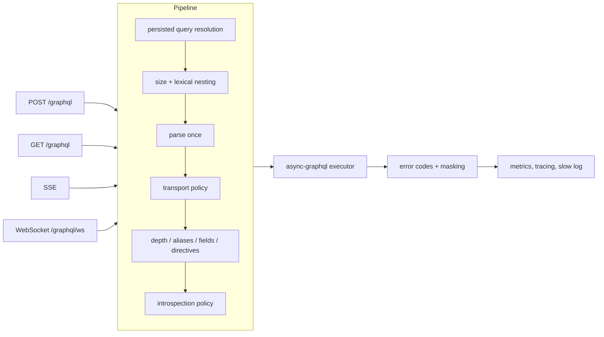

# autumn-plugin-graphql

Production-grade GraphQL for [Autumn](https://github.com/autumn-foundation/autumn).
Mount any [async-graphql](https://github.com/async-graphql/async-graphql)
schema on an Autumn app with one line, and get the operational surface a real
API needs: hardening, persisted operations, subscriptions, error hygiene,
observability, and configuration that operators can change without a deploy.

```rust
use async_graphql::Schema;
use autumn_plugin_graphql::GraphqlPlugin;

#[autumn_web::main]
async fn main() {
    let schema = Schema::build(Query, Mutation, Subscription).finish();
    autumn_web::app()
        .routes(routes![index])
        .plugin(GraphqlPlugin::new(schema))
        .run()
        .await;
}
```

That mounts:

| Method | Path | What |
|---|---|---|
| `POST` | `/graphql` | JSON, `application/graphql`, batched (opt-in) and multipart upload (opt-in) requests |
| `GET` | `/graphql?query=…` | Queries only; a mutation over `GET` is a `405` |
| `GET` | `/graphql/sdl` | The schema as SDL (dev by default) |
| `GET` | `/graphql/ws` | WebSocket: `graphql-transport-ws` and legacy `graphql-ws` (when the schema has subscriptions) |
| `POST`/`GET` with `Accept: text/event-stream` | `/graphql` | GraphQL over SSE (when the schema has subscriptions) |

`examples/notes.rs` is a complete app in one file — `cargo run --example notes`.

## Contents

- [Why a plugin](#why-a-plugin)
- [Features](#features)
- [Installation](#installation)
- [Configuration](#configuration)
- [Resolvers: context, errors, auth](#resolvers-context-errors-auth)
- [Hardening](#hardening)
- [Persisted operations](#persisted-operations)
- [Subscriptions](#subscriptions)
- [Observability](#observability)
- [Testing your API](#testing-your-api)
- [Autumn versions](#autumn-versions)
- [Migrating from the react-graphql example](#migrating-from-the-react-graphql-example)
- [Development](#development)

## Why a plugin

A GraphQL endpoint is one `POST` handler — until it is public. Then it needs
query-cost limits, a story for introspection in production, errors that do not
leak database detail through an HTTP `200`, subscriptions that do not bypass
the checks HTTP gets, and metrics. This crate packages those, built on
Autumn's own seams (`AppState`, `AutumnError`, the metrics registry, the
config loader, route declaration) so a GraphQL door into an app behaves like
every other door.

Every transport runs through **one pipeline**, so no path reaches the schema
without the same checks:



See [`docs/architecture.md`](docs/architecture.md) for the full design and
[`docs/adr/`](docs/adr) for the decisions behind it.

## Features

| Concern | What you get |
|---|---|
| **GraphQL over HTTP** | `application/graphql-response+json` with meaningful status codes (`400` for request errors, `504` for timeouts), `application/json` for legacy clients, `406`/`415` negotiation, `Vary`/`Cache-Control` from `@cacheControl` on `GET` |
| **Hardening** | Limits on document size, lexical nesting (checked *before* the parser), depth, aliases, root fields, total fields (fragment-bomb safe), directives; optional async-graphql complexity; mutations refused over `GET`; introspection and SDL off outside `dev`/`test`; CSRF preflight for multipart; execution timeouts; stream connection caps; body-size limits |
| **Persisted operations** | Apollo Automatic Persisted Queries with a pluggable store (in-memory LRU by default); trusted documents (safelisting) from an Apollo `persisted-query-manifest.json`; `documentId` requests |
| **Errors** | A stable `extensions.code` on every error; `AutumnError` → GraphQL mapping that keeps `4xx` messages, redacts `5xx`, and carries `extensions.status` and validation `extensions.fields`; masking of uncoded resolver errors in production |
| **Context** | `AppState` and `GraphqlRequestInfo` in every resolver; context hooks that run any `FromRequestParts` extractor (current user, tenant, DataLoaders); WebSocket `connection_init` auth |
| **Subscriptions** | WebSocket (two protocols) and SSE, through the same pipeline; `connection_init` timeout (`4408`); refused init (`4403`); keep-alive; graceful drain (`1001`) on shutdown or on demand |
| **Operations** | `[graphql]` in `autumn.toml` with profile layering and `AUTUMN_GRAPHQL__*` overrides; kill switch; Prometheus metrics at `/actuator/prometheus`; `tracing` spans; slow-operation log |
| **Framework fit** | Routes declared for `autumn routes` and the route audit; a `guard(layer)` seam for the nested router; `PluginContract` (see [Autumn versions](#autumn-versions)); passes Autumn's plugin conformance harness |
| **Schemas** | Static `Schema<Q, M, S>`, `SchemaBuilder` (so the plugin can apply schema-level limits), or any `Executor` such as `async_graphql::dynamic::Schema` |

## Installation

```toml
[dependencies]
autumn-plugin-graphql = "0.1"
async-graphql = { version = "7", default-features = false }
```

The crate re-exports `async_graphql`, so the two can never disagree.

> **Autumn needs at least one typed route.** `AppBuilder::run` refuses to
> boot when no `routes![…]` were registered, and routers a plugin nests do not
> count. A GraphQL-only service registers something — a landing page, a
> version route — as `examples/notes.rs` does.

## Configuration

Everything has a production-safe default; a zero-config mount is already
hardened. Settings come from the `[graphql]` section of `autumn.toml`,
layered exactly like Autumn's own configuration:

1. `autumn.toml` `[graphql]`
2. `[profile.<name>.graphql]` inline
3. `autumn-<profile>.toml` `[graphql]`
4. `AUTUMN_GRAPHQL__*` environment variables (and `.env` files)

Fluent setters in code are applied **on top**, so code can pin what
operations must not change. `.config(GraphqlConfig)` supplies the whole
configuration in code and reads no files.

```toml
[graphql]
enabled = true                  # kill switch: false mounts nothing
path = "/graphql"
introspection = "auto"          # auto = on in dev/test, off elsewhere
sdl = "auto"                    # auto = follows introspection
mask_unexpected_errors = "auto" # auto = off in dev/test, on elsewhere
allow_get = true
max_body_bytes = 1048576
timeout_ms = 30000              # 0 = none; subscriptions are never timed out
slow_operation_ms = 1000        # 0 = never log
csrf_prevention = true          # multipart needs a preflight-forcing header

[graphql.limits]                # 0 = unlimited, for every limit
max_query_bytes = 32768
max_nesting = 64                # lexical { ( [ nesting, before parsing
max_depth = 15
max_aliases = 30
max_root_fields = 30
max_fields = 1000
max_directives = 50
max_complexity = 0              # async-graphql cost model; needs from_builder

[graphql.batching]
enabled = false
max_operations = 10

[graphql.subscriptions]
websocket = "auto"              # auto = on when the schema has subscriptions
sse = "auto"
max_connections = 10000         # per endpoint; 0 = unlimited
keepalive_secs = 30
init_timeout_secs = 10

[graphql.persisted_queries]
mode = "disabled"               # disabled | automatic | trusted
cache_capacity = 1000
manifest = ""                   # path, relative to autumn.toml

[graphql.uploads]
enabled = false
max_files = 10
max_file_bytes = 10485760

[profile.prod.graphql.persisted_queries]
mode = "trusted"
manifest = "persisted-query-manifest.json"
```

Any leaf can be overridden from the environment:
`AUTUMN_GRAPHQL__LIMITS__MAX_DEPTH=10`, `AUTUMN_GRAPHQL__ENABLED=false`. An
override that does not type-check is logged and ignored (as core does); a bad
**file** value refuses boot, naming the key — a typo'd `introspection = flase`
must never silently leave introspection on in production.

In code:

```rust
GraphqlPlugin::new(schema)
    .path("/api/graphql")
    .introspection(false)
    .timeout(Duration::from_secs(10))
    .batching(5)
    .configure(|c| c.limits.max_depth = 8)
```

Two endpoints with different settings read different sections:
`.config_section("graphql_admin")` reads `[graphql_admin]`.

## Resolvers: context, errors, auth

Every resolver can read:

```rust
let state = ctx.data::<AppState>()?;                 // pool, extensions, config…
let info = ctx.data::<GraphqlRequestInfo>()?;        // method, headers, request id, transport
```

**Context hooks** run per HTTP operation and per WebSocket upgrade, with the
request's `Parts`, so any Autumn/axum extractor works:

```rust
GraphqlPlugin::new(schema)
    .context(|parts, state, data| Box::pin(async move {
        if let Ok(user) = CurrentUser::from_request_parts(parts, state).await {
            data.insert(user);
        }
        data.insert(DataLoader::new(UserLoader::new(state.clone()), tokio::spawn));
        Ok(())
    }))
    .on_ws_init(|payload, state| async move {
        // Browser WebSocket clients send credentials in connection_init.
        let mut data = async_graphql::Data::default();
        data.insert(authenticate(&state, payload["token"].as_str()).await?);
        Ok(data)
    })
```

Returning `Err(AutumnError)` from a hook refuses the request with that status
(a `401` stays a `401`), GraphQL-shaped.

**Errors.** Convert framework errors with `.gql()`:

```rust
use autumn_plugin_graphql::GraphqlResultExt as _;

async fn note(&self, ctx: &Context<'_>, id: ID) -> async_graphql::Result<Option<Note>> {
    repo(ctx)?.find_by_id(parse_id(&id)?).await.gql()
}
```

| `AutumnError` | `message` | `extensions` |
|---|---|---|
| `not_found_msg("note 9 not found")` | `note 9 not found` | `code: NOT_FOUND, status: 404` |
| `validation({title: ["too short"]})` | `title: too short` | `code: VALIDATION_FAILED, status: 422, fields: {title: [...]}` |
| `internal_server_error_msg("pg: …")` | `Internal server error` (detail logged) | `code: INTERNAL_SERVER_ERROR, status: 500` |

Errors a resolver raises **without** a code — a bare `?` on a library error,
`ctx.data::<T>()?` — are *unexpected*. With `mask_unexpected_errors` on (the
production default) their message becomes `Internal server error` and the
original is logged. Give an error a code (`graphql_error(codes::…, msg, status)`
or `.extend_with`) to show it to clients. Parse and validation errors are
coded `GRAPHQL_PARSE_FAILED` / `GRAPHQL_VALIDATION_FAILED`; every code the
plugin emits is in `autumn_plugin_graphql::codes`.

**Guarding the endpoint.** `AppBuilder::scoped` wraps only the `routes![]` it is
given, never a router a plugin nests, so guard the mount itself:

```rust
GraphqlPlugin::new(schema)
    .guard(RequireApiToken::new(store), "RequireApiToken")
```

The layer runs before every handler (SDL and the WebSocket upgrade included),
and the declared routes show as `Gated` in `autumn routes`. Under `prod`,
Autumn's CSRF layer also covers `POST /graphql`: browser clients send the
token (see the react-graphql example); a bearer-only mount can exempt its
path with `[security.csrf] exempt_paths = ["/graphql"]`.

## Hardening

Before anything executes, each operation is checked against
`[graphql.limits]`; a violation is refused with `QUERY_LIMIT_EXCEEDED` and
`extensions: { limit, max, actual }`:

| Limit | Guards against |
|---|---|
| `max_query_bytes` | huge documents |
| `max_nesting` | parser stack exhaustion — checked on raw text, before parsing |
| `max_depth` | deep recursion through cyclic types (`user { friends { friends { … } } }`) |
| `max_aliases` | alias amplification (`a1: expensive a2: expensive …`) |
| `max_root_fields` | wide root fan-out |
| `max_fields` | fragment bombs — counted with fragments expanded, analysed in linear time |
| `max_directives` | directive overloading |
| `max_complexity` | async-graphql's cost model (use `GraphqlPlugin::from_builder`) |

The analyzer's invariants — totality, linear cost, faithfulness to naive
expansion, cycle safety — are documented on `limits` and property-tested in
`tests/limits_properties.rs`.

Also: mutations and subscriptions over `GET` are refused (`405`), since a
`GET` is what caches, prefetchers and cross-site links replay; introspection
is refused with `INTROSPECTION_DISABLED` outside `dev`/`test`; multipart
requests must carry `apollo-require-preflight` (or
`graphql-require-preflight`) so a browser cannot send them cross-site without
a CORS preflight; operations time out (`OPERATION_TIMEOUT`).

## Persisted operations

**Automatic Persisted Queries** (`mode = "automatic"`) implement Apollo's
protocol: a client sends `extensions.persistedQuery.sha256Hash`; on
`PERSISTED_QUERY_NOT_FOUND` it re-sends with the document, which is verified
and cached. A fleet shares registrations by implementing
`PersistedQueryStore` over Redis and passing it to
`.persisted_query_store(..)`.

**Trusted documents** (`mode = "trusted"`) are a safelist: only operations
in the manifest run, whether the client sends the hash, a `documentId`, or the
full text. Generate the manifest at client build time (Apollo's
`generate-persisted-query-manifest`, GraphQL Code Generator's
`persisted-documents` preset, or a flat `{"<sha256>": "<document>"}` map) and
point `manifest` at it — or add documents in code with
`.trusted_documents(..)`. Boot is refused in trusted mode with no documents.
Limits still apply to persisted documents.

## Subscriptions

With a subscription root, `GET /graphql/ws` speaks `graphql-transport-ws`
(the `graphql-ws` library) and the legacy `graphql-ws`
(`subscriptions-transport-ws`), and `Accept: text/event-stream` switches
`POST`/`GET` to GraphQL over SSE. Both run the same pipeline as HTTP.

| Behaviour | Result |
|---|---|
| no `connection_init` within `init_timeout_secs` | close `4408` |
| `on_ws_init` returns `Err` | close `4403` |
| over `max_connections` | `503 TOO_MANY_CONNECTIONS` before the upgrade |
| app shutdown, or `plugin.drain_handle().drain()` | sockets close `1001`, SSE streams end with `complete` |

SSE passes through proxies, CSRF protection and the guard like any other
request; prefer it behind infrastructure that is unkind to WebSockets.

## Observability

Metrics go through Autumn's registry and appear at `/actuator/prometheus`:

| Family | Labels |
|---|---|
| `graphql_operations_total` | `endpoint`, `transport`, `operation`, `outcome` |
| `graphql_operation_duration_seconds` | `endpoint`, `transport`, `operation` |
| `graphql_errors_total` | `endpoint`, `code` |
| `graphql_active_streams` | `endpoint`, `transport` |

Operation *names* are deliberately not a label (client-controlled,
unbounded). Each operation runs in a `graphql.operation` span carrying its
name, type and a document hash, and operations slower than
`slow_operation_ms` are logged at `WARN`.

## Testing your API

With the `test-support` feature:

```rust
use autumn_plugin_graphql::testing::GraphqlTestExt as _;

let client = TestApp::new().plugin(GraphqlPlugin::new(schema())).build();
let res = client.graphql("{ notes { id } }").send().await;
res.assert_no_errors();
client.graphql("{ secret }").send().await.assert_error_code("FORBIDDEN");
```

Keep a committed `schema.graphql` honest (regenerate with
`AUTUMN_GRAPHQL_BLESS=1 cargo test`):

```rust
#[test]
fn committed_schema_matches_the_live_sdl() {
    autumn_plugin_graphql::sdl::assert_committed_sdl(
        &schema().sdl(),
        concat!(env!("CARGO_MANIFEST_DIR"), "/schema.graphql"),
    );
}
```

## Autumn versions

| This crate | `autumn-web` | Notes |
|---|---|---|
| `0.1` | `0.7` (crates.io) | default features |
| `0.1` + `plugin-contract` | `main` / the next release | adds `Plugin::contract`, which the published `0.7.0` does not have |

CI runs the suite against both. The `plugin-contract` feature declares the
supported `autumn-web` range so `autumn plugin-check` and the startup
compatibility gate can see it; turn it on once your app is on a release that
ships `autumn_web::plugin_contract`.

If your app turns on async-graphql's `boxed-trait` feature, turn on this
crate's `boxed-trait` feature too (async-graphql changes the shape of its
`Executor` trait under it).

## Migrating from the react-graphql example

The plugin started life as `examples/react-graphql/src/graphql_plugin.rs` in
the Autumn repository. The builder surface is source-compatible —
`new`, `path`, `guard`, `without_sdl`, `route_infos` — with two changes:

1. The type parameter is the executor:
   `GraphqlPlugin<Schema<Query, Mutation, Subscription>>` instead of
   `GraphqlPlugin<Query, Mutation, Subscription>`.
2. `PLUGIN_NAME` is `"autumn-plugin-graphql"`.

Replacing the in-tree module with

```rust
pub use autumn_plugin_graphql::{GraphqlPlugin, PLUGIN_NAME};
```

passes that example's own test suite unchanged (see
[`docs/verification.md`](docs/verification.md)).

## Development

```bash
cargo fmt --all --check
cargo clippy --all-targets --features test-support -- -D warnings
cargo test --features test-support
cargo run --example notes
```

See [`CLAUDE.md`](CLAUDE.md) for conventions and [`CHANGELOG.md`](CHANGELOG.md)
for release notes.

## License

Apache-2.0
