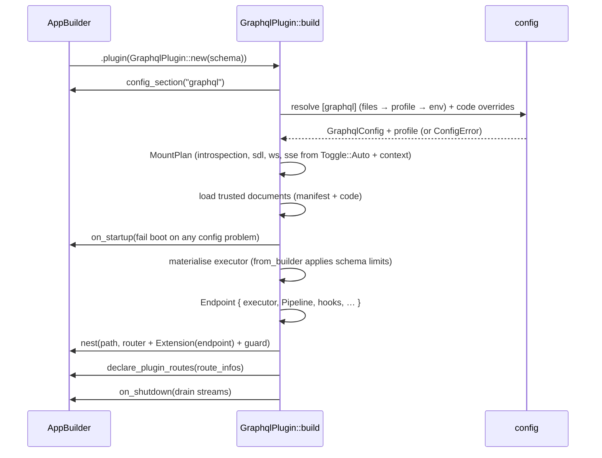
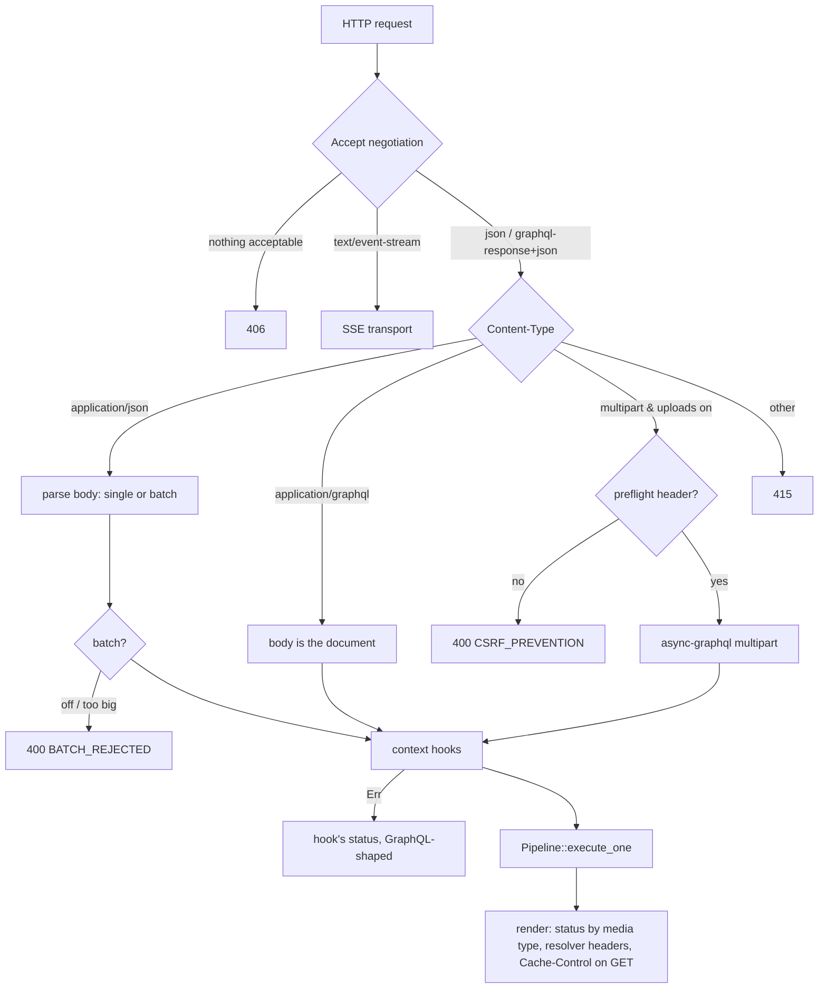
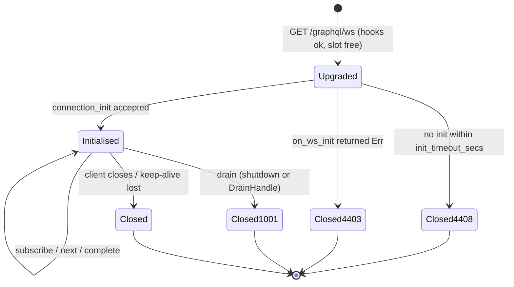

# Architecture

`autumn-plugin-graphql` adapts any async-graphql `Executor` onto an Autumn
app. This page describes how a request travels, where each guarantee is
enforced, and how the pieces map to modules.

## Modules

| Module | Responsibility |
|---|---|
| `plugin` | `GraphqlPlugin`: builder API, config resolution, schema materialisation, router assembly, route declaration, contract, startup validation, drain on shutdown |
| `config` | The `[graphql]` section: types, defaults, validation, profile layering, `AUTUMN_GRAPHQL__*` overrides |
| `pipeline` | The one path to the executor: `prepare` → execute → `finish`, rejections, timeouts, `GuardedExecutor` for streaming transports |
| `limits` | Pre-parse text checks and the operation analyzer (depth, aliases, root fields, fields, directives, introspection) |
| `persisted` | APQ store trait + in-memory LRU, trusted-document manifests, SHA-256 |
| `error` | `extensions.code` vocabulary, `AutumnError` mapping, masking, request errors |
| `context` | `GraphqlRequestInfo`, `ContextHook`, `WsInitHook`, `Transport` |
| `transport::http` | `POST`/`GET`/`sdl`: body parsing, content negotiation, batching, multipart, response headers |
| `transport::ws` | WebSocket upgrade, sub-protocols, init timeout, connection caps, drain |
| `transport::sse` | GraphQL over SSE (distinct connections) |
| `metrics` | Prometheus families through Autumn's registry |
| `sdl` | Committed-SDL drift check |
| `testing` | `TestClient` helpers (feature `test-support`) |

## Mounting

Configuration problems never panic inside `build` (it cannot return an
error); they are collected and returned from a startup hook, which aborts
boot with every problem named.

The endpoint's state rides on its nested router as an `axum::Extension`
rather than as a type-keyed `AppState` extension, so two endpoints built from
the same schema type at different paths never share (or overwrite) state.

## Request path

## The pipeline

`Pipeline::prepare` is the only road to the executor. HTTP calls it through
`execute_one`; the WebSocket and SSE transports hand async-graphql a
`GuardedExecutor`, whose `execute`/`execute_stream` call it too.

| Step | Refusal | Status (`graphql-response+json`) |
|---|---|---|
| APQ / trusted-document resolution | `PERSISTED_QUERY_*`, `OPERATION_NOT_ALLOWLISTED` | 400 / 404 / 403 |
| size, lexical nesting | `QUERY_LIMIT_EXCEEDED` | 413 / 400 |
| parse (once; reused by the executor) | left to the executor → `GRAPHQL_PARSE_FAILED` | 400 |
| mutation/subscription over `GET` | `METHOD_NOT_ALLOWED` | 405 (for every media type) |
| operation analysis | `QUERY_LIMIT_EXCEEDED`, `INTROSPECTION_DISABLED` | 400 |
| execution | `OPERATION_TIMEOUT` | 504 |

Under `application/json` every GraphQL-level outcome is a `200`, as legacy
clients expect; transport-level refusals (`405`, `413` body, `415`, `406`,
hook errors) keep their status everywhere.

`finish` gives every error an `extensions.code`, masks uncoded execution
errors when configured, records metrics, and logs slow operations.

## Analyzer invariants

`limits::analyze` receives attacker-controlled input. Its contract:

- **Totality** — returns for every document; saturating arithmetic;
  recursion bounded by `MAX_ANALYSIS_RECURSION`.
- **Linear cost** — each fragment is analysed once and memoized.
- **Faithfulness** — for acyclic documents, equal to naive expansion.
- **Cycle safety** — a reachable fragment cycle is `FragmentCycle`.
- **Decision rule** — refused iff some statistic exceeds a non-zero limit.

These are exercised by unit tests and by property tests
(`tests/limits_properties.rs`) that compare the memoized analyzer with a
naive expander over randomly generated acyclic documents.

## Streams and draining

Each WebSocket connection and SSE stream holds a `StreamSlot` (a semaphore
permit plus the `graphql_active_streams` gauge) for its lifetime.
`DrainHandle` is a generation counter on a `watch` channel: every stream ends
on the first change after it subscribed, so a drain cannot be missed by a
slow receiver, and streams opened after a drain are unaffected.
